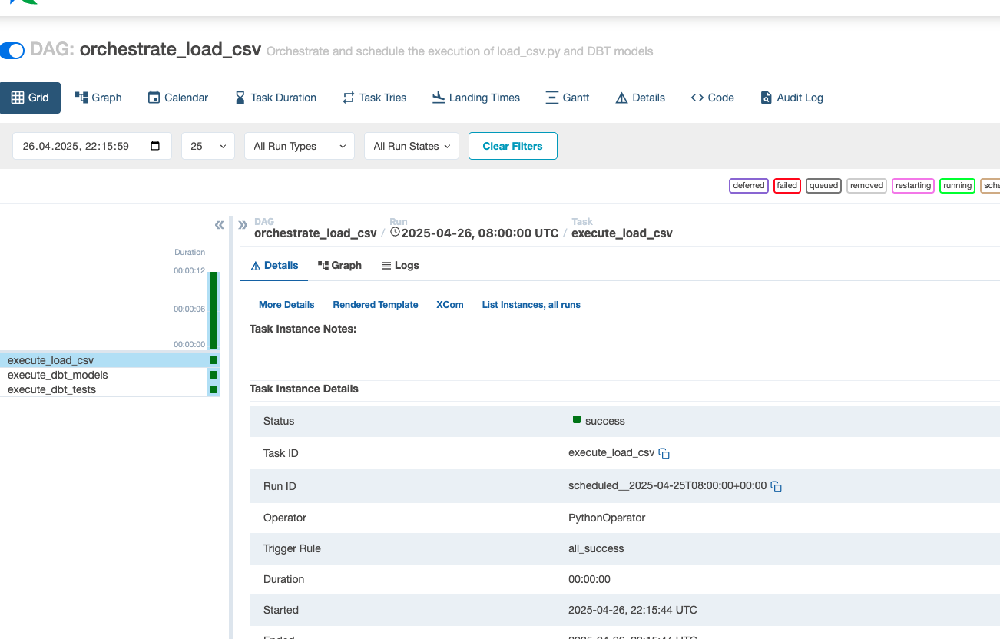

# Data Engineering Project: Orchestrating a Data Pipeline with Airflow and DBT

## Table of Contents
1. [Intro](#intro)
2. [Data Pipeline Flow](#data-pipeline-flow)
3. [DBT ERD Flow](#dbt-erd-flow)
4. [Approach](#approach)
5. [Tech Stack](#tech-stack)
6. [Quick Start](#quick-start)
7. [Testing via the Airflow UI](#testing-via-the-airflow-ui)
8. [Incremental Loading](#incremental-loading)
9. [Future Improvements](#future-improvements)

---

## Intro
This project demonstrates a data engineering pipeline that processes raw sales data, transforms it using DBT, and orchestrates the workflow using Apache Airflow. The pipeline is containerized using Docker for easy deployment and scalability.

> **Note**: The development environment (`dev`) was used to test and showcase the working pipeline. The DBT `profiles.yml` file is configured to use the `dev` target by default.

---

## Data Pipeline Flow


---

## DBT ERD Flow

  

---

## Approach

### 1. Choosing an ELT Approach
- **Why ELT over ETL?**
  - ELT (Extract, Load, Transform) allows raw data to be ingested into the database first, enabling transformations to be performed closer to the data.
  - This approach leverages the database's processing power for transformations, making it more scalable and efficient for large datasets.
  - It also ensures that raw data is preserved for auditing and debugging purposes.

### 2. Landing Zone (Raw Schema)
- The raw data is ingested into the `raw__sales` schema in the PostgreSQL database.
- This schema acts as the landing zone, where the data is stored in its original format before any transformations are applied.

### 3. Handling Data Quality Issues
- **Blank Values in Location**:
  - Blank or invalid values in the `Location` field are defaulted to `Unknown` for records where the `Channel` is `Online`.
  - This ensures consistency and avoids null values in the staging table.

- **Fixing Price Field**:
  - The `Price` field in the raw data contains a currency suffix (e.g., `USD`) for some records
  - During transformation, the `USD` suffix is removed, and the field is cast to a numeric type.
  - The field is renamed to `price_in_usd` in the staging table for clarity.

> **Note**: Since we are using an ELT approach, these data quality issues are fixed during the transformation step in DBT, rather than during ingestion. This aligns with the business requirements to preserve raw data for auditing and debugging purposes.

### 4. Adding Metadata Fields
- **_etl_timestamp**:
  - A timestamp field is added to record the exact time the data was loaded into the database.
  - This helps in tracking data lineage and debugging issues related to data freshness.

- **source_filename**:
  - A field is added to store the name of the source file from which the data was ingested.
  - This helps in identifying the origin of the data and simplifies reprocessing if needed.

### 5. Unit Testing with Pytest
- **Pytest** is used to create unit tests for the `load_csv` Python script.
- These tests validate:
  - The correct ingestion of CSV data into the database.
  - Handling of edge cases, such as missing or malformed data.
  - Database connection and insertion logic.

### 6. Indexing for Performance
- A unique index is created on the `SaleID` column in the `raw__sales.fct_sales` table to optimize retrieval.
- **Alternative Approaches**:
  - Clustering the table based on `SaleID` for faster sequential scans.
  - Partitioning the table by date or region for better query performance on large datasets.

### 7. DBT Approach
- DBT is used for data transformation and testing:
  - **Staging Models**: Clean and standardize raw data into staging tables (e.g., `stg_sales`).
  - **Testing**: Validate data quality using DBT's built-in tests (e.g., `not_null`, `unique`) and custom tests (e.g., `assert_no_negative_values`).
  - **Modular Design**: Each transformation step is modular, making it easier to debug and maintain.

### 8. Airflow Approach
- Apache Airflow is used to orchestrate the pipeline:
  - Tasks are defined as dependent steps in a DAG (`orchestrate_load_csv`).
  - Tags are used to group related tasks for better organization and monitoring.
  - The DAG includes the following tasks:
    1. **`execute_load_csv`**: Ingest raw data into the database.
    2. **`execute_dbt_models`**: Transform raw data using DBT models.
    3. **`execute_dbt_tests`**: Validate the transformed data using DBT tests.

---

## Tech Stack
- **Apache Airflow**: Workflow orchestration and scheduling.
- **DBT (Data Build Tool)**: Data transformation and testing.
- **PostgreSQL**: Database for raw and transformed data.
- **Docker**: Containerization for consistent environments.
- **Pandas**: Data manipulation for CSV ingestion.
- **Python**: Core programming language for custom scripts.
- **Pytest**: Unit testing framework for Python.

---

## Quick Start
### Prerequisites
1. Install [Docker Desktop](https://www.docker.com/products/docker-desktop) and ensure it is running.
2. Install [Docker Compose](https://docs.docker.com/compose/install/) for managing multi-container applications.
3. Clone this repository:
   ```bash
   git clone https://github.com/sarinravishanker/interview-data-engineer.git
   git checkout sarin_interview
   cd interview-data-engineer #make sure you are in this folder
   ```

### Steps
1. **Build and Start the Containers**:
   ```bash
   docker-compose up --build -d
   ```
   This will:
   - Start a PostgreSQL database.
   - Start Airflow webserver and scheduler.
   - Mount the required directories for DAGs, scripts, and DBT projects.

2. **Access the Airflow UI**:
   - Open [http://localhost:8080](http://localhost:8080) in your browser.
   - Login credentials:
     - Username: `airflow`
     - Password: `airflow`

3. **Verify the Setup**:
   - Check the running containers:
     ```bash
     docker-compose ps
     ```
   - Ensure all services (`postgres`, `airflow-webserver`, `airflow-scheduler`) are running.

4. **Initialize the Database**:
   - The `initdb` folder contains SQL scripts to initialize the `airflow` and `sales` databases.
   - These scripts are automatically executed when the PostgreSQL container starts.

---

## Testing via the Airflow UI
1. **Access the Airflow UI**:
   - Open [http://localhost:8080](http://localhost:8080) in your browser.

2. **Trigger the DAG**:
   - Locate the DAG named `orchestrate_load_csv`.
   - Click the "Trigger DAG" button to start the pipeline.

3. **Monitor the Workflow**:
   - View the progress of tasks (`execute_load_csv`, `execute_dbt_models`, `execute_dbt_tests`) in the Airflow UI.

  


4. **Verify the Results**:
   - Check the PostgreSQL database to ensure the raw and transformed data is loaded correctly:
     ```bash
     docker exec -it <postgres-container-id> psql -U postgres -d sales
     SELECT * FROM raw__sales.fct_sales LIMIT 10;
     ```

5. **Check DBT Models in PostgreSQL**:
   - Follow these steps to verify that the DBT models were created and the data is loaded correctly:
     1. **Access the PostgreSQL Container**:
        ```bash
        docker exec -it <postgres-container-id> psql -U postgres -d sales
        ```
        Replace `<postgres-container-id>` with the actual container ID or name of the PostgreSQL service. You can find it by running:
        ```bash
        docker ps
        ```

     2. **List Available Schemas**:
        ```sql
        \dn
        ```
        You should see schemas like `raw__sales`, `dev_stg__sales`, and `dev_stg__dimensions`.

     3. **List Tables in the Schema**:
        ```sql
        \dt dev_stg__sales.*
        ```
        This will list all tables in the `dev_stg__sales` schema.

     4. **Query the DBT Models**:
        ```sql
        SELECT * FROM dev_stg__sales.stg_sales LIMIT 10;
        ```
        This will display the first 10 rows of the `stg_sales` table.

     5. **Verify Raw Data**:
        ```sql
        SELECT * FROM raw__sales.fct_sales LIMIT 10;
        ```

     6. **Verify Dimension Table (`dim_products`)**:
        - Query the `dim_products` table to ensure the data is aggregated correctly:
          ```sql
          SELECT * FROM dev_stg__dimensions.dim_products LIMIT 10;
          ```
        - Verify that the `productid`, `productname`, `brand`, and `category` fields are populated correctly.

     7. **Exit the PostgreSQL Prompt**:
        ```bash
        \q
        ```

---

## Incremental Loading

### Assumptions
- Incremental loading assumes that `SaleID` is a **unique identifier** and always increases sequentially.
- To fetch only the latest data, the maximum `SaleID` is retrieved from the `raw__sales.fct_sales` table, and only records with `SaleID` greater than this value are inserted.
- For illustrative purposes, an additional DAG has been created specifically for incremental loading. This DAG uses a hardcoded file containing the existing data along with one new record featuring a higher `SaleID`.

### Steps to Simulate Incremental Loading

1. **Run the Initial Load**:
   - Trigger the `orchestrate_load_csv` DAG in Airflow to load the initial data from `generated_sales_data.csv`.

2. **Run the Incremental Load**:
   - Trigger the `orchestrate_load_csv_incremental` DAG in Airflow to load only the new records.

3. **Verify the Results**:
   - Check the Airflow logs to confirm the number of records inserted. The logs will display a message like:
     ```
     Maximum SaleID in the database: 1005
     Number of new records to insert: 1
     Inserted 1 new records into raw__sales.fct_sales.
     ```

4. **View the Records in PostgreSQL**:
   - Access the PostgreSQL database to verify that only the new records have been inserted:
     ```bash
     docker exec -it <postgres-container-id> psql -U postgres -d sales
     SELECT * FROM raw__sales.fct_sales ORDER BY SaleID DESC LIMIT 10;
     ```

### Notes
- Ensure that the `SaleID` values in the updated data are greater than the maximum `SaleID` already present in the database.
- Use the Airflow logs to debug and confirm the number of records inserted during the incremental load process.

---

## Future Improvements

### 1. Combine `load_csv` and `load_csv_incremental` into One Script
- Refactor the `load_csv` and `load_csv_incremental` scripts into a single, modular script.
- Add a parameter to toggle between full and incremental loading modes.
- This will reduce code duplication and improve maintainability.

### 2. Airflow Improvements
- Implement **Pytest** for DAG validation and testing to ensure DAGs are functioning as expected.
- Add **task-level retries** and **alerting mechanisms** for better error handling and monitoring.
- Use **Airflow Variables** or **Connections** to manage configuration dynamically instead of hardcoding values.

### 3. DBT Improvements
- Add **custom tests** in DBT to validate business-specific rules (e.g., no negative prices, valid product IDs).
- Implement **snapshot testing** to track changes in slowly changing dimensions (SCDs).
- Use macros to prevent repeated sql code

### 4. Modular Design
- Improve the modularity of the pipeline by separating concerns:
  - Create reusable utility functions for database operations.
  - Use a configuration file (e.g., `config.yaml`) to manage paths, database credentials, and other settings.
- This will make the pipeline easier to extend and adapt to new requirements.

### 5. Scalability and Performance
- Optimize database queries for better performance, especially for large datasets.
- Explore partitioning and indexing strategies for the `raw__sales` table to improve query efficiency.
- Consider using a distributed data warehouse (e.g., Snowflake, BigQuery) for scalability.

---

