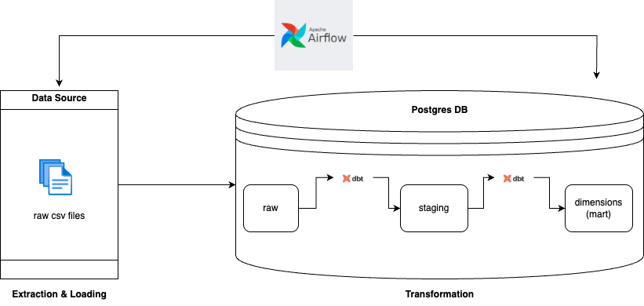
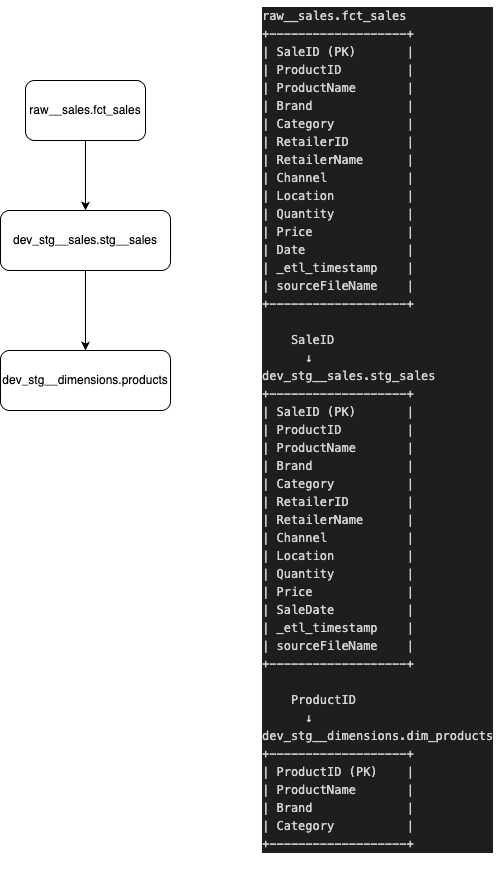

# Data Engineering Project: Orchestrating a Data Pipeline with Airflow and DBT

## Table of Contents
1. [Intro](#intro)
2. [Data Pipeline Flow](#data-pipeline-flow)
3. [DBT ERD Flow](#dbt-erd-flow)
4. [Approach](#approach)
5. [Tech Stack](#tech-stack)
6. [Features](#features)
7. [Quick Start](#quick-start)
8. [Steps to Run the Docker Containers](#steps-to-run-the-docker-containers)
9. [Testing via the Airflow UI](#testing-via-the-airflow-ui)

---

## Intro
This project demonstrates a data engineering pipeline that processes raw sales data, transforms it using DBT, and orchestrates the workflow using Apache Airflow. The pipeline is containerized using Docker for easy deployment and scalability.

> **Note**: The development environment (`dev`) was used to test and showcase the working pipeline. The DBT `profiles.yml` file is configured to use the `dev` target by default.

---

## Data Pipeline Flow



---

## DBT ERD Flow

  


---

## Approach

### 1. Choosing an ELT Approach
- **Why ELT over ETL?**
  - ELT (Extract, Load, Transform) allows raw data to be ingested into the database first, enabling transformations to be performed closer to the data.
  - This approach leverages the database's processing power for transformations, making it more scalable and efficient for large datasets.
  - It also ensures that raw data is preserved for auditing and debugging purposes.

### 2. Landing Zone (Raw Schema)
- The raw data is ingested into the `raw__sales` schema in the PostgreSQL database.
- This schema acts as the landing zone, where the data is stored in its original format before any transformations are applied.

### 3. Unit Testing with Pytest
- **Pytest** is used to create unit tests for the `load_csv` Python script.
- These tests validate:
  - The correct ingestion of CSV data into the database.
  - Handling of edge cases, such as missing or malformed data.
  - Database connection and insertion logic.

### 4. Indexing for Performance
- A unique index is created on the `SaleID` column in the `raw__sales.fct_sales` table to optimize retrieval.
- **Alternative Approaches**:
  - Clustering the table based on `SaleID` for faster sequential scans.
  - Partitioning the table by date or region for better query performance on large datasets.

### 5. DBT Approach
- DBT is used for data transformation and testing:
  - **Staging Models**: Clean and standardize raw data into staging tables (e.g., `stg_sales`).
  - **Testing**: Validate data quality using DBT's built-in tests (e.g., `not_null`, `unique`) and custom tests (e.g., `assert_no_negative_values`).
  - **Modular Design**: Each transformation step is modular, making it easier to debug and maintain.

### 6. Airflow Approach
- Apache Airflow is used to orchestrate the pipeline:
  - Tasks are defined as dependent steps in a DAG (`orchestrate_load_csv`).
  - Tags are used to group related tasks for better organization and monitoring.
  - The DAG includes the following tasks:
    1. **`execute_load_csv`**: Ingest raw data into the database.
    2. **`execute_dbt_models`**: Transform raw data using DBT models.
    3. **`execute_dbt_tests`**: Validate the transformed data using DBT tests.

---

## Tech Stack
- **Apache Airflow**: Workflow orchestration and scheduling.
- **DBT (Data Build Tool)**: Data transformation and testing.
- **PostgreSQL**: Database for raw and transformed data.
- **Docker**: Containerization for consistent environments.
- **Pandas**: Data manipulation for CSV ingestion.
- **Python**: Core programming language for custom scripts.
- **Pytest**: Unit testing framework for Python.

---

## Features
- **CSV Ingestion**: Reads raw sales data from CSV files and loads it into a PostgreSQL database.
- **Data Transformation**: Cleans and transforms raw data using DBT models.
- **Data Testing**: Validates data quality using DBT tests.
- **Orchestration**: Automates the entire workflow using Apache Airflow.
- **Containerized Setup**: Simplifies deployment with Docker.
- **Unit Tests**: Basic unit tests for the `load_csv` Python script to validate CSV ingestion logic and database interactions.

---

## Quick Start
### Prerequisites
1. Install [Docker Desktop](https://www.docker.com/products/docker-desktop).
2. Clone this repository:
   ```bash
   git clone https://github.com/sarinravishanker/interview-data-engineer.git
   cd interview-data-engineer
   ```

---

## Steps to Run the Docker Containers
1. **Build and Start the Containers**:
   ```bash
   docker-compose up --build -d
   ```
   This will:
   - Start a PostgreSQL database.
   - Start Airflow webserver and scheduler.
   - Mount the required directories for DAGs, scripts, and DBT projects.

2. **Verify the Setup**:
   - Check the running containers:
     ```bash
     docker-compose ps
     ```
   - Access the Airflow UI at [http://localhost:8080](http://localhost:8080).
   - Login credentials:
     - Username: `airflow`
     - Password: `airflow`

3. **Initialize the Database**:
   - The `initdb` folder contains SQL scripts to initialize the `airflow` and `sales` databases.
   - These scripts are automatically executed when the PostgreSQL container starts.

---

## Testing via the Airflow UI
1. **Access the Airflow UI**:
   - Open [http://localhost:8080](http://localhost:8080) in your browser.

2. **Trigger the DAG**:
   - Locate the DAG named `orchestrate_load_csv`.
   - Click the "Trigger DAG" button to start the pipeline.

3. **Monitor the Workflow**:
   - View the progress of tasks (`execute_load_csv`, `execute_dbt_models`, `execute_dbt_tests`) in the Airflow UI.

4. **Verify the Results**:
   - Check the PostgreSQL database to ensure the raw and transformed data is loaded correctly:
     ```bash
     docker exec -it <postgres-container-id> psql -U postgres -d sales
     SELECT * FROM raw__sales.fct_sales LIMIT 10;
     ```

5. **Check DBT Models in PostgreSQL**:
   - Follow these steps to verify that the DBT models were created and the data is loaded correctly:
     1. **Access the PostgreSQL Container**:
        ```bash
        docker exec -it <postgres-container-id> psql -U postgres -d sales
        ```
        Replace `<postgres-container-id>` with the actual container ID or name of the PostgreSQL service. You can find it by running:
        ```bash
        docker ps
        ```

     2. **List Available Schemas**:
        ```sql
        \dn
        ```
        You should see schemas like `raw__sales`, `dev_stg__sales`, and `dev_stg__dimensions`.

     3. **List Tables in the Schema**:
        ```sql
        \dt dev_stg__sales.*
        ```
        This will list all tables in the `dev_stg__sales` schema.

     4. **Query the DBT Models**:
        ```sql
        SELECT * FROM dev_stg__sales.stg_sales LIMIT 10;
        ```
        This will display the first 10 rows of the `stg_sales` table.

     5. **Verify Raw Data**:
        ```sql
        SELECT * FROM raw__sales.fct_sales LIMIT 10;
        ```

     6. **Exit the PostgreSQL Prompt**:
        ```bash
        \q
        ```

---

## Notes
- Ensure the `csv_files` directory contains valid CSV files before triggering the DAG.
- Update the `profiles.yml` file in the `dbt_project` folder to configure DBT profiles for different environments.
- Use the `logs` directory to debug any issues with Airflow tasks or DBT commands.

---