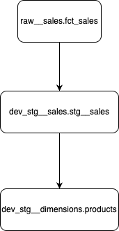

# Data Engineering Project: Orchestrating a Data Pipeline with Airflow and DBT

## Table of Contents
1. [Intro](#intro)
2. [Tech Stack](#tech-stack)
3. [Features](#features)
4. [Quick Start](#quick-start)
5. [Steps to Run the Docker Containers](#steps-to-run-the-docker-containers)
6. [Testing via the Airflow UI](#testing-via-the-airflow-ui)
7. [Data Pipeline Flow](#data-pipeline-flow)
8. [DBT ERD Flow](#dbt-erd-flow)

---

## Intro
This project demonstrates a data engineering pipeline that processes raw sales data, transforms it using DBT, and orchestrates the workflow using Apache Airflow. The pipeline is containerized using Docker for easy deployment and scalability.

> **Note**: The development environment (`dev`) was used to test and showcase the working pipeline. The DBT `profiles.yml` file is configured to use the `dev` target by default.

---

## Tech Stack
- **Apache Airflow**: Workflow orchestration and scheduling.
- **DBT (Data Build Tool)**: Data transformation and testing.
- **PostgreSQL**: Database for raw and transformed data.
- **Docker**: Containerization for consistent environments.
- **Pandas**: Data manipulation for CSV ingestion.
- **Python**: Core programming language for custom scripts.
- **Pytest**: Unit testing framework for Python.

---

## Features
- **CSV Ingestion**: Reads raw sales data from CSV files and loads it into a PostgreSQL database.
- **Data Transformation**: Cleans and transforms raw data using DBT models.
- **Data Testing**: Validates data quality using DBT tests.
- **Orchestration**: Automates the entire workflow using Apache Airflow.
- **Containerized Setup**: Simplifies deployment with Docker.
- **Unit Tests**: Basic unit tests for the `load_csv` Python script to validate CSV ingestion logic and database interactions.

---

## Quick Start
### Prerequisites
1. Install [Docker Desktop](https://www.docker.com/products/docker-desktop).
2. Clone this repository:
   ```bash
   git clone https://github.com/sarinravishanker/interview-data-engineer.git
   cd interview-data-engineer
   ```

---

## Steps to Run the Docker Containers
1. **Build and Start the Containers**:
   ```bash
   docker-compose up --build -d
   ```
   This will:
   - Start a PostgreSQL database.
   - Start Airflow webserver and scheduler.
   - Mount the required directories for DAGs, scripts, and DBT projects.

2. **Verify the Setup**:
   - Check the running containers:
     ```bash
     docker-compose ps
     ```
   - Access the Airflow UI at [http://localhost:8080](http://localhost:8080).
   - Login credentials:
     - Username: `airflow`
     - Password: `airflow`

3. **Initialize the Database**:
   - The `initdb` folder contains SQL scripts to initialize the `airflow` and `sales` databases.
   - These scripts are automatically executed when the PostgreSQL container starts.

---

## Testing via the Airflow UI
1. **Access the Airflow UI**:
   - Open [http://localhost:8080](http://localhost:8080) in your browser.

2. **Trigger the DAG**:
   - Locate the DAG named `orchestrate_load_csv`.
   - Click the "Trigger DAG" button to start the pipeline.

3. **Monitor the Workflow**:
   - View the progress of tasks (`execute_load_csv`, `execute_dbt_models`, `execute_dbt_tests`) in the Airflow UI.

4. **Verify the Results**:
   - Check the PostgreSQL database to ensure the raw and transformed data is loaded correctly:
     ```bash
     docker exec -it <postgres-container-id> psql -U postgres -d sales
     SELECT * FROM raw__sales.fct_sales LIMIT 10;
     ```

---

## Data Pipeline Flow


---

## DBT ERD Flow



---

## Notes
- Ensure the `csv_files` directory contains valid CSV files before triggering the DAG.
- Update the `profiles.yml` file in the `dbt_project` folder to configure DBT profiles for different environments.
- Use the `logs` directory to debug any issues with Airflow tasks or DBT commands.

---